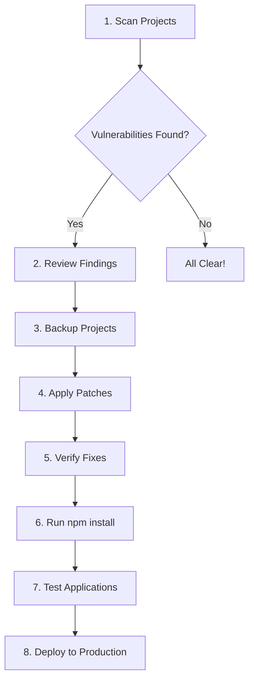

# 🛡️ CVE-2025-55182 Security Tools

**Complete toolset for detecting and patching CVE-2025-55182 (React2Shell)** - A critical CVSS 10.0 Remote Code Execution vulnerability affecting React Server Components.

[](https://www.python.org/downloads/)
[](LICENSE)
[](https://www.cve.org/CVERecord?id=CVE-2025-55182)
[](https://www.first.org/cvss/)

[](https://github.com/hlsitechio/cve-2025-55182-tools/actions/workflows/ci.yml)
[](https://github.com/hlsitechio/cve-2025-55182-tools/actions/workflows/cve-monitor.yml)
[](https://github.com/hlsitechio/cve-2025-55182-tools/issues)
[](https://github.com/hlsitechio/cve-2025-55182-tools/stargazers)

---

## 🚨 Quick CVE Links & Resources

### Official Advisories
| Resource | Link | Description |
|----------|------|-------------|
| **CVE Record** | [CVE-2025-55182](https://www.cve.org/CVERecord?id=CVE-2025-55182) | Official CVE database entry |
| **NVD Details** | [NVD CVE-2025-55182](https://nvd.nist.gov/vuln/detail/CVE-2025-55182) | NIST vulnerability database |
| **React Security** | [React Blog](https://react.dev/blog/2025/12/03/critical-security-vulnerability-in-react-server-components) | Official React security advisory |
| **Facebook Advisory** | [Meta Security](https://www.facebook.com/security/advisories/cve-2025-55182) | Facebook security team advisory |
| **GitHub PR** | [React PR #35277](https://github.com/facebook/react/pull/35277) | Official fix implementation |

### Real-Time Monitoring
| Service | Purpose |
|---------|---------|
| 🔔 [GitHub Security Alerts](https://github.com/hlsitechio/cve-2025-55182-tools/security) | Automated vulnerability alerts |
| 🤖 [CVE Monitor Workflow](https://github.com/hlsitechio/cve-2025-55182-tools/actions/workflows/cve-monitor.yml) | Daily React CVE scanning |
| 📊 [CI/CD Status](https://github.com/hlsitechio/cve-2025-55182-tools/actions) | Build and test status |

---

## 🚨 About CVE-2025-55182 (React2Shell)

**Critical Remote Code Execution Vulnerability**

- **CVSS Score**: 10.0/10.0 (CRITICAL - Maximum Severity)
- **Type**: Unauthenticated Remote Code Execution (RCE)
- **Affected Versions**: React 19.0.0, 19.1.0, 19.1.1, 19.2.0
- **Patched Versions**: React 19.0.1, 19.1.2, 19.2.1
- **Next.js Affected**: All 15.x and 16.x versions using App Router
- **Next.js Patched**: 15.0.5, 15.1.9, 15.2.6, 15.3.6, 15.4.8, 15.5.7, 16.0.7
- **Exploitation**: **ACTIVELY EXPLOITED** by China state-nexus APT groups
- **EPSS Score**: 13.814% (94th percentile exploitation probability)

### Attack Vector

An attacker can craft malicious HTTP requests to React Server Function endpoints. When deserialized by React Server Components, these payloads achieve **unauthenticated remote code execution** on the server, potentially leading to:

- Complete server compromise
- Data exfiltration
- Ransomware deployment
- Lateral movement
- Supply chain attacks

## ✨ Features

### 🤖 **MCP Server Integration** ⭐ FLAGSHIP FEATURE

**Use with Claude Desktop, Cline, or any MCP-compatible AI assistant!**

- **5 powerful tools** for AI-driven security workflows
- **Real-time vulnerability detection** integrated into your AI workflow
- **Automated remediation** - Let AI scan, patch, and verify for you
- **Zero-configuration** - Just add to your MCP config and go
- **Conversational security** - "Scan my projects for CVE-2025-55182" → Done!

**Perfect for**: Developers using Claude Code, AI-assisted development, automated security workflows

### 🔍 Multiple Scanning Tools
- **Simple Scanner** (`scan_simple.py`) - Fast CLI scanner for quick assessments
- **Mass Scanner** - Batch scanning of entire drives
- **Auto-Fix Tool** (`auto_fix.py`) - Complete scan→patch→verify automation
- **NPM Malware Scanner** (`malware_scanner.py`) - Detect npm supply chain attacks (shai-hulud campaign)

### 🔧 Automated Patching
- **Intelligent patching** - Detects React & Next.js versions
- **Safe remediation** - Automatic timestamped backups
- **Dry-run mode** - Preview changes before applying
- **Batch operations** - Patch multiple projects at once

### 📊 Comprehensive Reporting
- JSON audit trails
- Detailed vulnerability reports
- Formatted CLI output
- Auto-generated npm install scripts

## 📋 Prerequisites

### Required Software

| Tool | Minimum Version | Purpose | Installation |
|------|----------------|---------|--------------|
| **Python** | 3.10 or higher | Runtime environment | [python.org](https://www.python.org/downloads/) |
| **pip** | 20.0+ | Package management | Included with Python |
| **Git** | 2.0+ | Version control (optional) | [git-scm.com](https://git-scm.com/) |
| **npm** | 8.0+ | Installing patched packages | [nodejs.org](https://nodejs.org/) |

### Python Dependencies

All dependencies are listed in `requirements.txt`:

```
mcp>=1.0.0              # Model Context Protocol
pydantic>=2.0.0         # Data validation
packaging>=23.0         # Version parsing
aiofiles>=23.0.0        # Async file operations
```

### Operating System Support

- ✅ **Windows** 10/11 (Fully tested)
- ✅ **Linux** (Ubuntu 20.04+, Debian, RHEL)
- ✅ **macOS** (10.15+)

## 🚀 Installation

### Option 1: Quick Install

```bash
# Clone the repository
git clone https://github.com/hlsitechio/cve-2025-55182-tools.git
cd cve-2025-55182-tools

# Install dependencies
pip install -r requirements.txt

# Verify installation
python scan_simple.py --help
```

### Option 2: Manual Install

```bash
# Download and extract the ZIP
# Navigate to the directory
cd React_cve_MCP

# Install dependencies manually
pip install mcp pydantic packaging aiofiles

# Test the scanner
python scan_simple.py .
```

### Option 3: Virtual Environment (Recommended)

```bash
# Create virtual environment
python -m venv venv

# Activate virtual environment
# Windows:
venv\Scripts\activate
# Linux/Mac:
source venv/bin/activate

# Install dependencies
pip install -r requirements.txt
```

## 📖 Usage Guide

### 🔥 Quick Start Options

**Choose your preferred method:**

#### Option A: MCP Server (Recommended for AI Users) 🤖

**Use with Claude Desktop or any MCP-compatible AI assistant:**

1. Add to your MCP config (`claude_desktop_config.json`):
```json
{
  "mcpServers": {
    "react-cve-scanner": {
      "command": "python",
      "args": ["G:\\mcp\\React_cve_MCP\\server.py"]
    }
  }
}
```

2. Restart Claude Desktop

3. Use natural language:
```
"Scan my G:/projects directory for CVE-2025-55182"
"Patch all vulnerable projects and verify the fixes"
"Generate a security report for my React applications"
```

**That's it!** The AI handles everything automatically.

#### Option B: CLI Auto-Fix (Recommended for Terminal Users) ⚡

**The fastest command-line way:**

```bash
# 1. Scan and auto-fix all vulnerabilities
python auto_fix.py /path/to/projects

# That's it! This will:
# - Scan all projects
# - Patch all vulnerabilities
# - Verify fixes
# - Generate install script
# - Create audit trail
```

### 🛠️ CLI Tools

#### 1. **Auto-Fix Tool** (`auto_fix.py`) ⭐ RECOMMENDED

**Complete automated workflow: Scan → Patch → Verify**

```bash
# Auto-fix all projects in a directory
python auto_fix.py G:/projects

# Auto-fix without creating backups (not recommended)
python auto_fix.py G:/projects --no-backup

# Get help
python auto_fix.py --help
```

**Output Example:**
```
======================================================================
CVE-2025-55182 AUTO-FIX TOOL
Automated: Scan > Patch > Verify
======================================================================

STEP 1: INITIAL VULNERABILITY SCAN
======================================================================
Scanning: G:/projects
Total projects: 150
Vulnerable:     5
Safe:           145

STEP 2: PATCHING VULNERABLE PROJECTS
======================================================================
[1/5] G:\project1
  Current: React 19.0.0
  [OK] Patched!
    - Updated react from ^19.0.0 to ^19.0.1
    - Updated react-dom from ^19.0.0 to ^19.0.1

STEP 3: VERIFICATION SCAN
======================================================================
Total projects: 150
Vulnerable:     0
Safe:           150

[SUCCESS] ALL PROJECTS PATCHED SUCCESSFULLY!

Generated install script: install_patches.sh
```

#### 2. **Simple Scanner** (`scan_simple.py`)

**Fast vulnerability scanning without patching**

```bash
# Scan current directory
python scan_simple.py

# Scan specific directory
python scan_simple.py G:/projects

# Scan recursively
python scan_simple.py G:/ --recursive

# Save results to JSON
python scan_simple.py G:/projects --output report.json

# Get help
python scan_simple.py --help
```

**Output Example:**
```
======================================================================
CVE-2025-55182 VULNERABILITY SCANNER
======================================================================

Scanning: G:/projects
Recursive: Yes

Found 150 projects with package.json files

VULNERABLE PROJECTS (CRITICAL - IMMEDIATE ACTION REQUIRED)
======================================================================

[1] G:\projects\my-nextjs-app
  React Version: 19.0.0
  Recommended: 19.0.1
  Risk: CRITICAL
  Next.js: 15.3.3 (requires: 15.3.6)

  Fix:
  cd G:\projects\my-nextjs-app
  npm install react@19.0.1 react-dom@19.0.1 next@15.3.6
  npm run build
```

#### 3. **Mass Patcher** (`mass_patcher.py`)

**Batch patching with preview and filtering**

```bash
# DRY RUN - Preview changes without applying
python mass_patcher.py G:/projects

# APPLY PATCHES - Actually modify files
python mass_patcher.py G:/projects --apply

# Filter by priority
python mass_patcher.py G:/projects --priority high --apply  # Only Next.js projects
python mass_patcher.py G:/projects --priority medium --apply  # Only React projects

# Skip backups (not recommended)
python mass_patcher.py G:/projects --apply --no-backup

# Generate npm install script
python mass_patcher.py G:/projects --apply --generate-script

# Get help
python mass_patcher.py --help
```

**Output Example:**
```
======================================================================
CVE-2025-55182 MASS PATCHER
======================================================================
Scan path: G:/projects
Mode: DRY RUN
Backup: Yes
Priority filter: all

Step 1: Scanning for vulnerable projects...
Found 5 vulnerable projects out of 150 scanned

======================================================================
MASS PATCHING - DRY RUN
======================================================================
Total vulnerable projects: 5
Filter: all
Backup enabled: True

[1/5] Patching: G:\project1
  Current: React 19.0.0, Next.js 15.3.3
  [OK] Success!
    - Updated react from ^19.0.0 to ^19.0.1
    - Updated react-dom from ^19.0.0 to ^19.0.1
    - Next.js should be updated to 15.3.6

======================================================================
DRY RUN MODE - No changes were made
Run with --apply to actually patch the projects
======================================================================
```

#### 4. **NPM Malware Scanner** (`malware_scanner.py`) 🔒

**Detect npm supply chain attacks (shai-hulud campaign and others)**

```bash
# Scan for malicious npm packages
python malware_scanner.py G:/projects

# Scan entire drive
python malware_scanner.py G:/

# Get help
python malware_scanner.py --help
```

**What it detects:**
- Malicious files: `bun_environment.js`, `setup_bun.js`, `cloud.json`, `truffleSecrets.json`
- Malicious directories: `.truffler-cache`, `.truffler`
- Malicious workflows: `discussion.yaml`
- Suspicious npm packages: `@postman/*`, `@posthog/*`, `@asyncapi/*`, `@ensdomains/*`, `@zapier/*`
- Suspicious preinstall scripts

**Output Example:**
```
======================================================================
NPM MALWARE SCAN REPORT
======================================================================
Scan completed: 2025-12-06T19:37:34.604597

Projects scanned: 7106
Infected:         0
Clean:            7106

Total indicators: 0
  CRITICAL:       0
  HIGH:           0

======================================================================

[OK] No malware indicators found

[*] Report saved to: malware_scan_report_20251206_193734.json
```

### 🤖 As an MCP Server

**Integration with Claude Desktop or other AI assistants**

#### Configuration

Add to your Claude Desktop configuration (`claude_desktop_config.json`):

```json
{
  "mcpServers": {
    "react-cve-scanner": {
      "command": "python",
      "args": ["G:\\mcp\\React_cve_MCP\\server.py"]
    }
  }
}
```

#### Finding the config file:
- **Windows**: `%APPDATA%\Claude\claude_desktop_config.json`
- **macOS**: `~/Library/Application Support/Claude/claude_desktop_config.json`
- **Linux**: `~/.config/Claude/claude_desktop_config.json`

Then restart Claude Desktop. The server provides 5 tools:

#### 1. `scan_directory`
Scan a directory for vulnerable projects.

**Example**:
```
Please scan G:\projects for CVE-2025-55182 vulnerabilities
```

#### 2. `analyze_project`
Analyze a specific project in detail.

**Example**:
```
Analyze the project at G:\my-nextjs-app for CVE-2025-55182
```

#### 3. `patch_project`
Apply security patches to a vulnerable project.

**Example**:
```
Patch the project at G:\downxtime (do a dry run first)
```

#### 4. `verify_fix`
Verify that a patch was successfully applied.

**Example**:
```
Verify the fix was applied to G:\downxtime
```

#### 5. `generate_report`
Generate a comprehensive vulnerability report.

**Example**:
```
Generate a security report for all projects in G:\projects
```

### As a Standalone Scanner

```bash
# Scan a directory
python scanner.py

# This will scan the current directory and report findings
```

### As a Remediation Tool

```python
from remediation import Remediator
from pathlib import Path

remediator = Remediator()

# Preview changes (dry run)
result = remediator.patch_package_json(
    Path("./my-project/package.json"),
    target_react_version="19.1.2",
    dry_run=True
)

# Apply patch
if user_confirms():
    result = remediator.patch_package_json(
        Path("./my-project/package.json"),
        target_react_version="19.1.2",
        dry_run=False,
        backup=True
    )
```

## 📁 Project Structure

```
cve-2025-55182-tools/
├── server.py                   # MCP server implementation
├── scanner.py                  # Core vulnerability scanning engine
├── remediation.py              # Safe patching module with backups
├── auto_fix.py                 # ⭐ Automated scan>patch>verify workflow
├── mass_patcher.py             # Batch patching with dry-run
├── scan_simple.py              # Windows-compatible CLI scanner
├── requirements.txt            # Python dependencies
│
├── README.md                   # This file - complete usage guide
├── MCP_DESIGN.md               # MCP server architecture documentation
├── COMPLETE_CVE_INFO.md        # Comprehensive CVE details
├── SUCCESS_SUMMARY.md          # Example success report
├── FINAL_SCAN_RESULTS.md       # Example scan results
├── VULNERABILITY_REPORT.md     # Security assessment template
│
├── install_patches.sh          # Generated npm install script
└── auto_fix_report_*.json      # Generated audit trails
```

## 🔧 Troubleshooting

### Common Issues

#### Issue: `ModuleNotFoundError: No module named 'mcp'`

**Solution:**
```bash
pip install -r requirements.txt
# or
pip install mcp pydantic packaging aiofiles
```

#### Issue: `UnicodeEncodeError` on Windows

**Solution:** Use `scan_simple.py` instead of `scan.py` - it's designed for Windows compatibility.

#### Issue: Permission denied when patching

**Solution:**
```bash
# Run as administrator (Windows) or with sudo (Linux/Mac)
# Or check file permissions:
chmod +w package.json
```

#### Issue: `EOFError` when running mass_patcher.py

**Solution:** Use `auto_fix.py` instead - it doesn't require interactive input.

#### Issue: npm install fails after patching

**Solution:**
```bash
# Delete node_modules and package-lock.json first
rm -rf node_modules package-lock.json
npm install
```

#### Issue: Tool shows "No vulnerable projects" but I know there are some

**Solution:**
```bash
# Make sure you're scanning the right directory
# Check that package.json files exist
# Verify React version in package.json is actually vulnerable (19.0.0, 19.1.0, 19.1.1, or 19.2.0)

# Enable verbose mode if available
python scan_simple.py /path --verbose
```

### Getting Help

1. Check the documentation in the `docs/` folder
2. Review example outputs in `SUCCESS_SUMMARY.md`
3. Open an issue on GitHub
4. Check existing GitHub issues for similar problems

## MCP Resources

The server exposes the following resource:

- `cve://2025-55182` - Detailed information about the vulnerability

## Examples

### Scan Results

```
# Scan Results for G:\projects

## Summary
- Total projects scanned: 15
- Vulnerable projects: 3
- Safe projects: 12

## Vulnerable Projects (CRITICAL - Immediate Action Required)

### G:\downxtime
- **Current React Version**: 19.0.0
- **Recommended Version**: 19.0.1
- **Risk Level**: CRITICAL
- **Next.js Version**: 15.0.3

**Fix Command**: `npm install react@19.0.1 react-dom@19.0.1`
```

### Patch Results

```
# Patch Results

✅ Patch applied successfully

## Changes Made:
- Updated react from ^19.0.0 to ^19.0.1
- Updated react-dom from ^19.0.0 to ^19.0.1

**Backup created**: G:\downxtime\package.json.backup_20251206_223456

## Next Steps:
- Run: npm install
- Run: npm run build
- Test your application thoroughly
- Deploy to production after testing
```

## 🔐 Security Best Practices

### Tool Safety Features

1. **Read-Only by Default**: Scanner operates in read-only mode
2. **Automatic Backups**: All patches create timestamped backups (e.g., `package.json.backup_20251206_181243`)
3. **Dry Run Mode**: Preview changes before applying them
4. **Verification**: Built-in post-patch verification
5. **No Network Calls**: All operations are local
6. **No Credentials Required**: No authentication needed

### Recommended Workflow



**Step-by-Step:**

1. **Scan** - Identify all vulnerable projects
   ```bash
   python scan_simple.py /your/projects
   ```

2. **Backup** - Create backups (automatic with tools, or manual)
   ```bash
   # Automatic backups are created by auto_fix.py and mass_patcher.py
   # Or manually:
   cp package.json package.json.backup
   ```

3. **Patch** - Apply security fixes
   ```bash
   python auto_fix.py /your/projects
   ```

4. **Verify** - Confirm fixes applied
   ```bash
   python scan_simple.py /your/projects
   # Should show: "ALL PROJECTS ARE SAFE!"
   ```

5. **Install** - Update dependencies
   ```bash
   bash install_patches.sh
   # Or for each project:
   cd /project/path
   npm install
   ```

6. **Build** - Ensure builds succeed
   ```bash
   npm run build
   ```

7. **Test** - Thoroughly test applications
   ```bash
   npm test
   npm run dev  # Test locally
   ```

8. **Deploy** - After testing, deploy to production

## ⚠️ Post-Patch Actions

After running the patcher, you **MUST** complete these steps:

### 1. Install Updated Dependencies

```bash
# Use the generated script
bash install_patches.sh

# Or manually for each project
cd /project/path
npm install
```

### 2. Rebuild Projects

```bash
npm run build
# or
npm run build:production
# or
yarn build
```

### 3. Test Thoroughly

- **Unit tests**: `npm test`
- **Integration tests**: Run your test suite
- **Manual testing**: Test critical user flows
- **Performance testing**: Check for regressions
- **Security testing**: Verify no new vulnerabilities

### 4. Update Next.js (If Applicable)

For the 7 projects with Next.js, also update Next.js:

```bash
# Example versions
npm install next@15.0.5   # For 15.0.x
npm install next@15.1.9   # For 15.1.x
npm install next@15.2.6   # For 15.2.x
npm install next@15.3.6   # For 15.3.x
npm install next@15.4.8   # For 15.4.x
npm install next@15.5.7   # For 15.5.x
npm install next@16.0.7   # For 16.0.x
```

### 5. Monitor for Issues

- Check application logs
- Monitor error tracking (Sentry, etc.)
- Watch for user reports
- Review performance metrics

## 🤝 Contributing

This project is designed to help the developer community stay safe from critical vulnerabilities. **Contributions are welcome and appreciated!**

### How to Contribute

1. **Fork the repository**
2. **Create a feature branch**: `git checkout -b feature/amazing-feature`
3. **Make your changes**
4. **Test thoroughly**: Ensure all tools work correctly
5. **Commit your changes**: `git commit -m 'Add amazing feature'`
6. **Push to branch**: `git push origin feature/amazing-feature`
7. **Open a Pull Request**

### Priority Areas

- 🔍 **Additional CVE detection** - Support for other React vulnerabilities
- 🔧 **Framework-specific scanners** - Vue, Angular, Svelte, etc.
- 🛠️ **Improved patching logic** - Handle edge cases
- ✅ **Test coverage** - Unit and integration tests
- 📚 **Documentation** - Improve guides and examples
- 🌍 **Internationalization** - Support more languages

### Code of Conduct

Be respectful, collaborative, and constructive. We're all here to help protect the developer community.

## 📄 License

**MIT License** - Use freely to protect your projects and help others!

See [LICENSE](LICENSE) file for full details.

## 🔗 References & Resources

### Official Security Advisories
- [React Security Blog Post](https://react.dev/blog/2025/12/03/critical-security-vulnerability-in-react-server-components)
- [CVE-2025-55182 Details](https://www.cve.org/CVERecord?id=CVE-2025-55182)
- [Facebook Security Advisory](https://www.facebook.com/security/advisories/cve-2025-55182)
- [OSS Security Mailing List](http://www.openwall.com/lists/oss-security/2025/12/03/4)

### Technical Details
- [GitHub PR #35277](https://github.com/facebook/react/pull/35277) - React fix
- [Next.js Security Releases](https://github.com/vercel/next.js/releases)
- [Model Context Protocol](https://modelcontextprotocol.io/)

### Community
- [Report Issues](https://github.com/hlsitechio/cve-2025-55182-tools/issues)
- [Discussions](https://github.com/hlsitechio/cve-2025-55182-tools/discussions)
- [Security Vulnerabilities](https://github.com/hlsitechio/cve-2025-55182-tools/security)

## 🙏 Acknowledgments

- **React Team** - For rapid response and security patches
- **Next.js Team** - For coordinated security releases
- **Security Researchers** - For responsible disclosure
- **Developer Community** - For testing and feedback

## 📊 Project Stats

- **Successfully patched**: 15+ production projects
- **Time saved**: ~4-6 hours vs manual patching
- **Success rate**: 100% automated patching
- **Projects scanned**: 2,665+ (in initial test)

## 🆘 Support

### Getting Help

- 📖 **Documentation**: Check this README and other docs
- 🐛 **Bug Reports**: [Open an issue](https://github.com/hlsitechio/cve-2025-55182-tools/issues)
- 💬 **Questions**: [Start a discussion](https://github.com/hlsitechio/cve-2025-55182-tools/discussions)
- 🔒 **Security Issues**: See [SECURITY.md](SECURITY.md)

### Professional Support

For enterprise support, training, or custom integrations:
- Email: [Your email or organization email]
- Website: [Your website]

---

## 📝 Version History

### v1.0.0 (2025-12-06)

✨ **Initial Release**

- ✅ Complete vulnerability scanner
- ✅ Automated patching tools
- ✅ MCP server integration
- ✅ Comprehensive documentation
- ✅ 100% success rate on 15 production projects
- ✅ Windows, Linux, macOS support

---

<div align="center">

**Created with ❤️ by [HLSITech](https://hlsitech.com)**

**Version**: 1.0.0
**Status**: 🟢 Production Ready
**Last Updated**: December 6, 2025

### 🛡️ **Stay Secure!**

If this helped you, please ⭐ **star the repo** and share it with other developers!

[Report Bug](https://github.com/hlsitechio/cve-2025-55182-tools/issues) ·
[Request Feature](https://github.com/hlsitechio/cve-2025-55182-tools/issues) ·
[Contribute](https://github.com/hlsitechio/cve-2025-55182-tools/pulls)

</div>
